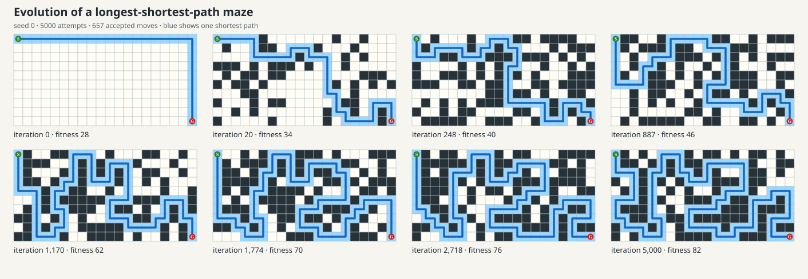

# Evolutionary maze generation

This example evolves a binary maze. A passage is `0`, a wall is `1`, and the
start and goal are fixed at the top-left and bottom-right. Fitness is the number
of steps in a shortest valid route between them. Longer routes score better;
disconnected mazes score `-1`.

The example is a clean Python reimplementation of the idea in XKG's
`SimpleEvoApp.kt`. It keeps the original `(1+1)` evolutionary strategy:

1. Start with an open grid.
2. Flip each mutable cell with probability
   `expected_mutations / mutable_cells`.
3. Measure the proposal with breadth-first search.
4. Accept the proposal when its fitness is at least the incumbent's fitness.
5. Repeat for a fixed number of attempts.

Equal-fitness moves are accepted because neutral changes can create a route to
later improvements. A seed owns every random choice, so a run is reproducible.

Fitness is an absolute path length and therefore depends strongly on grid size.
Raw scores should only be compared between runs with the same dimensions. For
example, seeds 0–2 give:

| Grid | Iterations | Scores | Mean | Seconds/maze |
|---|---:|---|---:|---:|
| 12×8 | 2,000 | 38, 38, 38 | 38.0 | 0.09 |
| 12×8 | 5,000 | 42, 48, 48 | 46.0 | 0.20 |
| 20×10 | 2,000 | 70, 70, 66 | 68.7 | 0.17 |
| 20×10 | 5,000 | 82, 88, 86 | 85.3 | 0.41 |

The interactive reference uses the last configuration. The LLM benchmark uses
12×8 grids to keep prompts, traces and contact sheets compact, which explains
why its conventional 2,000-iteration baseline is around 38 rather than 80.
Times are means of three local runs on the development machine and will vary by
hardware and system load.

## Static history

Generate an SVG showing selected fitness improvements:

```bash
uv run evo-maze render --seed 0 --iterations 5000
```

The default output is `results/pcg/maze_evolution.svg`. Each panel labels its
iteration and fitness. Blue marks one shortest path, dark cells are walls, and
the green `S` and red `G` mark the endpoints. The renderer samples the strict
fitness improvements evenly, retaining the initial and final mazes.



Use a smaller grid when demonstrating the mechanics on a slide:

```bash
uv run evo-maze render \
  --width 12 --height 8 --iterations 2000 --frames 8 \
  --output results/pcg/maze_evolution_small.svg
```

## Live run

The Tkinter view places the latest mutation beside the current incumbent. This
makes selection visible: the left maze is marked accepted or rejected, while
the right maze changes only after an accepted move.

```bash
uv run evo-maze live --seed 0 --iterations 5000
```

`--steps-per-frame` controls animation speed and `--delay-ms` controls the delay
between frames. Tkinter is part of Python's standard library rather than a pip
package. On macOS, `python -m tkinter` checks whether the active Python build
includes its GUI support.

## What changed from the Kotlin prototype

The prototype established the useful core experiment. This version separates
the grid model, evaluation, evolutionary loop, SVG renderer, live interface,
and tests. It also:

- uses iterative breadth-first search instead of recursive relaxation;
- returns paths from start to goal;
- represents a disconnected route explicitly with fitness `-1`;
- protects both endpoints during initialization and mutation;
- flips selected bits, making the mutation budget match the expected number of
  changed cells; and
- removes evaluator side effects so evaluation is a pure operation.

The implementation deliberately stops at conventional search. Its next role in
the tutorial is to become a tool that an LLM can call while constructing or
refining game content.
