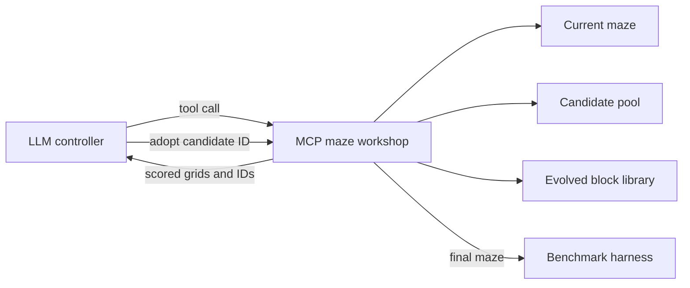

# Agentic LLM maze generation

The agentic generator gives an LLM a persistent maze workshop over MCP. The
model does not need to reproduce a spatial grid perfectly in its response. It
chooses editing and evaluation operations, compares candidates, explicitly
adopts one, and ends by returning `{"finish":true}`.



The HTTP client and MCP subprocess persist across all seeds for one configured
agent. Each seed resets the workshop with a reproducible initial maze, RNG and
evolved library. The model receives earlier final mazes in its generation brief
so it can also reason about set diversity.

## Tools

| Tool | Effect |
|---|---|
| `status` | Returns the incumbent grid, fitness, connectivity, and wall fraction |
| `mutate_batch` | Makes and scores a batch of local bit-flip candidates |
| `macro_mutation_batch` | Copies random rectangular fragments from evolved library mazes |
| `repair` | Carves the minimum number of walls needed to connect a candidate |
| `adopt` | Replaces the incumbent with a selected candidate ID |

The two mutation tools and repair only propose candidates. This separates
variation from selection: the LLM must call `adopt` to change the current maze.
Adoption clears older candidate IDs, preventing the model from accidentally
selecting a stale proposal created from an earlier incumbent.

The host-only `configure` and `export` MCP operations are never included in the
tool schemas sent to the model. `configure` transfers the initial maze, evolved
library, seed and hard batch cap. `export` retrieves the selected final maze
after the model finishes.

The reference run starts from the first evolved library member. The workshop
refuses to adopt a disconnected proposal; the model must repair it first. This
makes playability an environment invariant while leaving every subsequent
content change and selection decision explicit. Configurations can instead set
`initial_source` to `open` or `random`.

## Macro mutations

For each generation seed, the host creates a small library using independent,
seeded runs of the conventional evolutionary generator. A macro mutation:

1. selects a library maze;
2. selects a rectangular source block and target location;
3. copies the complete wall pattern into the current maze;
4. protects the start and goal cells; and
5. evaluates the resulting candidate with the same BFS fitness function.

This provides reusable structural material without asking the LLM to transmit
large arrays in tool arguments. The library is fixed during a maze run.
Library generation is preprocessing work, so the reference agentic condition
has a larger conventional-search budget than its headline tool-call count.

## Repair

Repair runs 0–1 breadth-first search over both walls and passages. Entering a
passage costs zero and entering a wall costs one. It then carves the resulting
minimum-wall route. The operation guarantees connectivity but may introduce a
short route, so the controller should normally repair first and then optimize.

## Run the paired comparison

```bash
./scripts/compare_maze_generators.sh \
  configs/pcg/maze_agentic_comparison.json \
  results/pcg/maze_agentic_comparison.json
```

The configuration compares conventional evolution, one-shot GPT-4o-mini, and
agentic GPT-4o-mini on three generation seeds through the OpenAI API. Both LLM
conditions use the same model and service. The report retains every model response, tool request,
argument, result, timing, adoption, and token count. The shared harness produces
the same fitness/diversity summary and PNG sheet as the one-shot experiment.

The model has bounded model-call, tool-call, batch, and library-generation
budgets. A malformed finish response receives a short protocol reminder within
the existing model-call budget. There is no automatic candidate adoption or
final repair that could conceal controller failure.

## Initial results

The three-seed reference run completed on 14 September 2026:

All rows use 12×8 mazes. Fitness is an absolute path length and must not be
compared directly with the 20×10 interactive demonstration.

| Generator | Valid | Mean fitness | Max | Gzip bytes | Mean Hamming | Seconds/maze |
|---|---:|---:|---:|---:|---:|---:|
| Evolution, 2,000 attempts | 3/3 | 38.0 | 38 | 114 | 0.486 | 0.10 |
| GPT-4o-mini, one shot | 1/3 | 18.0 | 18 | 50 | 0.000* | 1.00 |
| GPT-4o-mini, agentic MCP | 3/3 | 28.0 | 32 | 115 | 0.479 | 8.97 |

`*` Only one one-shot maze was valid, so no pairwise diversity comparison is
possible for that row.

The agentic controller made 28 model calls and 24 successful MCP tool calls
with no tool errors. It used one persistent HTTP client and one persistent MCP
process for all three seeds. Initial-to-final fitness was 30→32, 26→26 and
26→26. The first run crossed its plateau through neutral macro/local adoptions
before finding the improvement; the other two changed structure without raising
fitness.

This is a reliability and orchestration demonstration, not an equal-compute
comparison. Each agentic maze receives a six-member library built with 400
evolution iterations per member—2,400 conventional iterations of preprocessing—
as well as its model and tool budgets. The direct 2,000-iteration evolutionary
baseline remains faster and stronger. A later experiment should ablate the
library size, library budget, repair tool, and macro mutation independently.

- [Full agentic report](../results/pcg/maze_agentic_comparison.json)
- [Agentic comparison contact sheet](../results/pcg/maze_agentic_comparison.png)
- [CSV summary](../results/pcg/maze_agentic_comparison_summary.csv)
